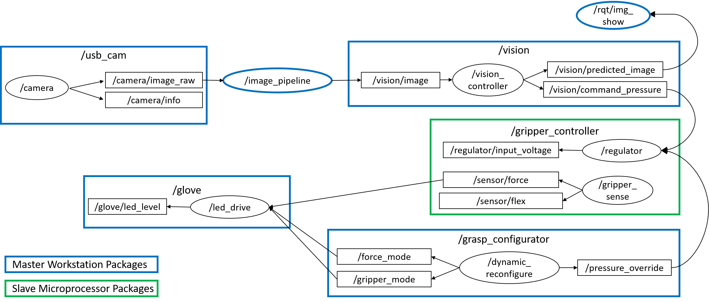

# gripper_teleop
ROS Packages for the SUTD Gripper teleoperation. Consists of 3 main modules:

1) Gripper driver : for acquiring gripper sensor data and sending vacuum commands

2) CNN-based classification package : classifies input gesture image to 9 gripper command classes

3) Wearable driver : interfaces with driver and sends force information for operator feedback

# Requirements
- Ubuntu 18.04
- ROS Melodic
- ROS dependencies - image_pipeline, intel_realsense (or any RGB camera driver), cv_bridge, std_msgs, rosserial_arduino
- OpenCV
- Tensorflow2
- Python 3.7
- Python dependencies: sklearn, numpy, pyserial, math

## Installation Steps

1) Install the teleoperation and gripper driver packages. If you are using a master-slave system, refer to node map below to install right packages on the right system.

2) Install dependencies listed above

3) Download model from [here](https://sutdapac-my.sharepoint.com/:f:/g/personal/snehal_jain_sutd_edu_sg/ErB0CbzHe6tGruoOy6DrV70BE9cW2EN_xPpyMtrvBLmUQg?e=GqT1ST). Save folder 'glove_model' in vision_commmand/scripts/

3) Run catkin_make

4) Setup arguments in launch file sutd_gripper.launch
  - ~sensor_port - serial device for sensor data acquisition (e.g. '/dev/ttyACM0')
  - ~regulator_port - serial device for regulating gripper pressure 

5) Setup argument in launch file glove_driver.launch
  - ~glove_port - serial device for wearable
  
6) Launch files 

	`$ roslaunch grasp_configurator glove_driver.launch`
Launches the wearable driver and dynamic reconfigure packages
	  
	`$ roslaunch vision_command glove_vision.launch`
Launches the camera node and gesture classification system
	  
	`$ roslaunch sutd_gripper sutd_gripper.launch`
Launches the gripper controller

## Dynamic Reconfigure

Using ROS dynamic_reconfigure, inputs to the teleoperation system can be given during runtime:

1) **grasp_mode** - selects actuation mode for SUTD Soft gripper ('int'; 0 (Default) - no grasping, 1 - Aperture Mode, 2 - Gripper Mode)
2) **payload_select** - select payload to be grasped ('enum'; Free Grasping (0) for no grasping force limits or Controlled Grasping (non-0) for force limits). Payload force definitions can be defined in scripts/payload.py
3) **hold_pressure** - sets pressure command to the previous available pressure command sent by gesture system ('bool')
4) **override_pressure** - allows manual override of gripper using dynamic_reconfigure ('bool')

## ROS Node Map

The image below shows the intended ROS-Node map for this system

## TroubleShooting

Serial connection issues:

	Error message: permission denied (get accurate error message).  This indicates the user does not have privellages to use the /dev/ttyUSBx.  The solution is to add the <user> to the "dialout" group.  After executing the following command, reboot.
	$ sudo adduser <user> dialout
	reboot

CVbridge issues: 

Download and compile cv_bridge in another workspace using `catkin build` according to [this guide](https://cyaninfinite.com/ros-cv-bridge-with-python-3/). Add `source $[CATKIN_BUILD_WORKSPACE]/devel/setup.bash` to your `~/.bashrc` for convenience.
